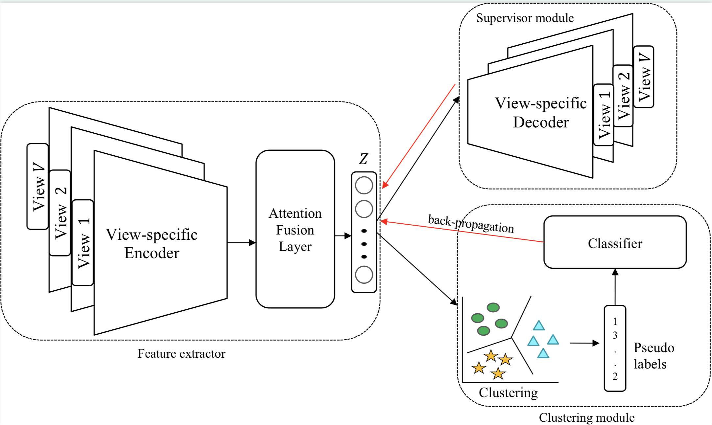
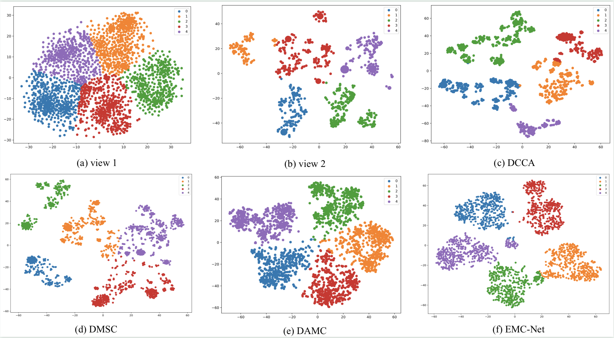

# EMC-Nets
The official repos of Efficient Multi-view Clustering Networks


## Abstract
Deep learning has made remarkable progress on multi-view clustering (MvC) in the last decade. Most existing literature 
adopted a broad target to guide network learning, such as minimize the reconstruction loss. It is effective but not 
efficient. In this paper, we proposed a novel framework, named Efficient Multi-view Clustering Networks (EMC-Nets),
 which guarantees the efficiency of the network learning and produces discriminative common representation efficiently 
 in multi- ple sources. Specifically, the proposed method alternates between the instruction process and approximation 
 process during training. The instruction process em- ploys a standard clustering algorithm, such as k-means, 
 to generate pseudo-labels corresponding to the current common representation. The approximation process leverages 
 pseudo-labels to force the network to approximate a reasonable cluster distribution. Experimental results on four 
 real-world datasets demonstrate that the proposed method outperforms state-of-the-art methods.
 

## Architecture




## Environment setting

- python 3.7
- pytorch 1.8.1
- CUDA 10.2

We recommend using `Conda` to setup the environment, and run as the following:

1. Create the virtual environment and install the requirements.
    ```
    conda create -n EMC-Nets python=3.7
    conda activate EMC-Nets
    cd EMC-Nets
    conda install --yes --file requirements.txt
    ```
2. Then, use unittest to test this project, following:
    ```
    cd tests
    export PYTHONPATH="../"
    python -m unittest
    ```

## Quickly validation

Run: 
```
python validation.py
```

Result:
```
------------------------------ Begin validation BDGP ------------------------------
CV 1 Beginning...
Acc.: 98.60% NMI: 95.41% purity: 98.60% and ARI: 96.55%
CV 2 Beginning...
Acc.: 98.56% NMI: 95.27% purity: 98.56% and ARI: 96.45%
CV 3 Beginning...
Acc.: 98.56% NMI: 95.27% purity: 98.56% and ARI: 96.45%
CV 4 Beginning...
Acc.: 98.56% NMI: 95.27% purity: 98.56% and ARI: 96.45%
CV 5 Beginning...
Acc.: 98.56% NMI: 95.27% purity: 98.56% and ARI: 96.45%
After ron 5 times, final Acc.: 98.57% NMI: 95.30% purity: 98.57% and ARI: 96.47%
------------------------------ End validation BDGP ------------------------------
```

More training details see `logs/`

## Training

Coming soon.

## Visualization

Here, we present the visualization of BDGP. More details see our paper, please.



## Cite

This paper is under review.

## Acknowledge

This paper was inspired by [DeepCluster](https://openaccess.thecvf.com/content_ECCV_2018/papers/Mathilde_Caron_Deep_Clustering_for_ECCV_2018_paper.pdf), 
[OnlineCluster](https://openaccess.thecvf.com/content_CVPR_2020/papers/Zhan_Online_Deep_Clustering_for_Unsupervised_Representation_Learning_CVPR_2020_paper.pdf).


